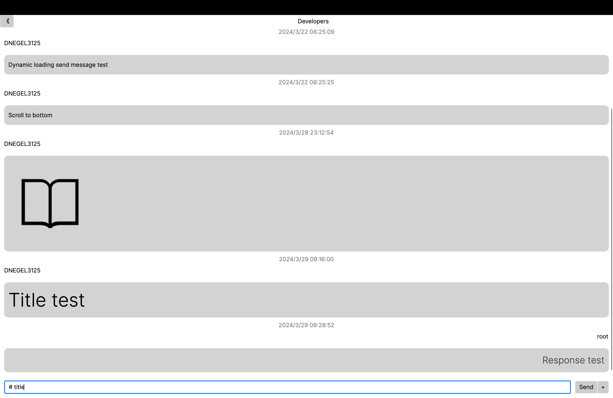

# Simple Chat
A simple chat app implemented using Avalonia.

## ChatView

Sending message using Markdown is available

## Run
#### IDE
Use run button in IDE

#### Command line
Use `dotnet run` in project root

## Todo

- If the user is not connected to the server when the
  image file is sent, the user will not be able to
  receive the image file.
- Implement sending of files other than images.
- Implement Friend function.
- Implement one-to-one chat.
- Implement logout.
- Save chat data locally